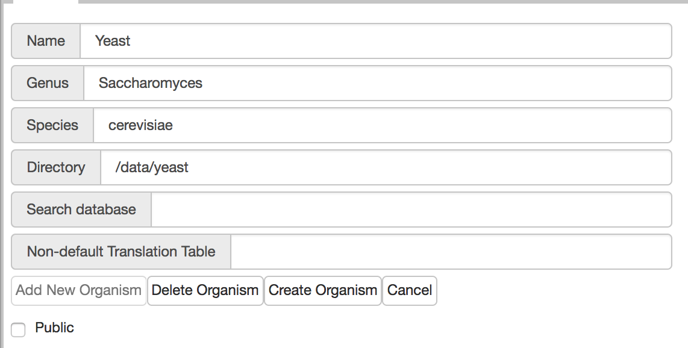

# Apollo

> Apollo is a browser-based tool for visualisation and editing of sequence
> annotations. It is designed for distributed community annotation efforts,
> where numerous people may be working on the same sequences in geographically
> different locations; real-time updating keeps all users in sync during the
> editing process.

## Running the Container

The container is publicly available as `quay.io/erasche/apollo:remote_user`.

The recommended method for launching the container is via docker-compose
due to a dependency on a postgres image.

There are a large number of environment variables that can be adjusted to suit
your site's needs. These can be seen in the
[apollo-config.groovy](https://github.com/GMOD/Apollo/blob/master/sample-docker-apollo-config.groovy)
file.

## Quickstart

`docker-compose up`

### Logging In

The default credentials in this image are:

| Credentials |                    |
| ---         | ------------------ |
| Username    | `admin@local.host` |
| Password    | `password`         |

### Loading Data

Some sample data is baked into the container for you to play around with:

### Chado

Chado support is now baked into the GMOD docker container image.
